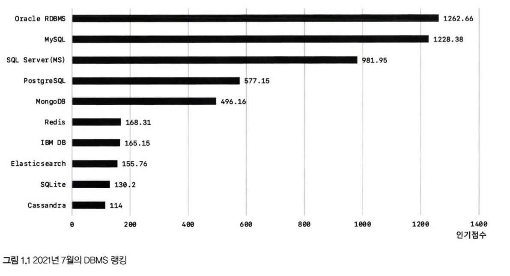

예제 데이터베이스 생성

```sql
CREATE DATEBASE emplyees
DEFAULT CHARACTER SET utf8mb4 COLLATE utf8mb4_0900_ai_ci;

USE emplyees

SOURCE emplyees.sql
```

# 01. 소개

<details open>
<summary> 역사 </summary>
<div markdown="1">

    1979’ 스웨덴 회사 TcX의 터미널 인터페이스 라이브러리 UNIREG

    1994’ 웹 시스템의 DB (MySQL 1.0)
    
    1996’ 외부 공개
    
    2000’ TcX에서 MySQL개발자가 MySQL AB회사로 독립 (FPL:Free Public License) 전환
    
    2006’ 엔터프라이즈 에디션 + 커뮤니티 에디션
    
    → 썬마이크로시스템즈 → 오라클 로 인수됨
    
    2011’ 엔터프라이즈 에디션은 더이상 소스공개 하지 않음 (MySQL 5.5)
    
    → 5.5~5.7 까지는 안정성과 성능에 집중, 8.0부터는상용 DBMS의 기능을 장착

</div>
</details>

## 왜 MySQL? 가격, 비용 경쟁력

DBMS 선택기준 : 안정성 → 성능과 기능 → 커뮤니티나 인지도


