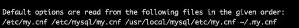

# 02. 설치와 설정

## 2.1 MySQL 서버 설치

### 엔터프라이즈 에디션 + 커뮤니티 에디션

- Open Core방식 : 두 에디션이 모두 동일하며, 특정 부가 기능만 엔터프라이즈 에디션에 포함

<details>
<summary> 부가기능 </summary>
<div markdown="1">

    Thread Pool

    Enterprise Audit
    
    Enterprise TDE(Master Key 관리)
    
    Enterprise Authentication
    
    Enterprise Firewall
    
    Enterprise Monitor
    
    Enterprise Backup
    
    → **Percona의 플러그인**에서 위 기능을 지원, 사실상 엔터프라이즈 에디션의 필요성이 크지 않았음
    
    MySQL 기술 지원

</div>
</details>


### 설치파일

- bin  : MySQL 서버와 클라이언트 프로그램 + 유틸리티
- data : 로그 + 데이터 파일
- include : C/C++ 헤더 파일들이 저장된
- lib : 라이브러리
- share : 지원 파일 + 에러 메세지 + 샘플 설정 파일(my.cnf)

## 2.2 MySQL 서버의 시작과 종료

### start/stop command
```shell
/usr/local/mysql/support-files/mysql.server start

/usr/local/mysql/support-files/mysql.server stop

/usr/local/mysql/my.cnf
```

```bash
cd /usr/local/mysql/bin

-- 1. 소켓 파일로 접속
./mysql -uroot -p --host=localhost --soket=/tmp/mysql.sock

-- 2. TCP/IP로 로컬호스트 접속 (원격호스트 접속시 사용)
./mysql -uroot -p --host=127.0.0.1 --port=3306

-- 3. 기본값 = localhost = 소켓파일 (소켓파일의 위치는 설정파일에서 읽어옴)
./mysql -uroot -p
```

<details open>
<summary> 환경변수 : 설정시 어디서나 mysql 명령어로 바로 접근 가능 </summary>
<div markdown="1">

    export "원하는 이름"="Users/본인계정명/원하는 경로를 이어서 작성"
    
    echo 'export MYSQL_PATH=/usr/local/mysql-8.0.26-macos11-arm64' >> ~/.zshrc
    echo 'export PATH=$PATH:$MYSQL_PATH/bin' >> ~/.zshrc
    source ~/.zshrc

</div>
</details>

`🤚 localhost VS 127.0.0.1`

- localhost : 항상 소켓 파일을 통해 접속 (Unix domain socket을 이용, IPC; Inter Process Communication)
- 127.0.0.1 : 자기 서버를 가리키는 루프백(loopback), TCP/IP

`🤚 유닉스 소켓파일 (mysql.sock)`

- MySQL 서버가 기동될 때 만들어짐.
- MySQL 서버 재시작하지 않으면 다시 만들 수 없음. 실수로 삭제하지 않도록 주의!

**MySQL 시작/종료** - InnoDB 스토리지 엔진의 버퍼 풀 내용을 백업복구

- 종료 : 실제 내용을 백업 하는게 아니고, 메타정보만 백업 (금방함)
- 시작 : 실제 데이터를 디스크에서 읽고, 적재 (오래걸림) 
  - 서버 시작 시간이 오래걸린다면? MySQL서버가 버퍼 풀의 내용을 복구 하고 있는지 확인

**SHUTDOWN**시에 트랜젝션을 커밋하지 않고 redo log에 기록

- clean shutdown을 하면 기록하지 않고 종료가능

    ```sql
    SET GLOBAL innodb_fast_shutdown=0;
    SHUTDOWN
    ```


**연결가능 확인**

```bash
-- 1. Telnet
telnet 10.2.40.61 3306

-- 2. Netcat
nc 10.2.40.61 3306
```

## 2.3 MySQL 서버 업그레이드

1. **In-Place Upgrade** : 데이터 파일 유지 + 업그레이드
    1. 제약사항이 따르나, 시간을 단축
2. **Logical Upgrade** : 데이터 덤프 후 + 업그레이드  (덤프툴 - mysqldump)
    1. 제약사항이 거의 없으나, 매우 많은 시간 소요됨

### In-Place Upgrade 제약사항

1) 마이너(패치) 버전간 업그레이드  ex. 8.0.16 → 8.0.21
   - 대부분 파일이 변경되지 않으며, 여러 버전을 건너뛸 수 있음
   - MySQL 서버 프로그램만 재설치

2) 메이저 버전간 업그레이드
   - 반드시 직전 버전에서만 업그레이드 허용 - 두 단계 이상의 업그레이드시에는, Logical Upgrade 권장
   - 데이터 파일의 패치 필요 (직전 버전의 데이터 파일과 로그 포맷만 인식하도록 구현됨)

**메이저 버전 업그레이드가 특정 마이너 버전에서만 가능한 경우 존재**

- 5.7.8 → 8.0 불가능
    - 5.7.8 버전이 GA(General Availability)가 아님. *GA - 오라클에서 서버의 안정성을 확인함
    - 최소 15~20번 이상의 마이너 버전에서 업그레이드 권장 - 이는 매뉴얼을 참조하여 결정

### MySQL 8.0 업그레이드 고려사항

1. 사용자 인증 방식 변경
    1. Native Authentication → Caching SHA-2 Authentication 으로 기본 인증 방식 변경됨
    2. 기존 방식 이용을 원하면, 서버 시작시 옵션 추가

       `—default-authentication-plugin=mysql_native_password`

2. MySQL 8.0과의 호환성 체크
    1. 손상된 FRM파일 or 데이터 타입 or 함수 의 호환을 확인
    - mysqlcheck 유틸리티

        ```bash
        ## mysqlcheck 유틸리티 실행 방법
        linux> mysqlcheck -u root -p --all-databases --check-upgrade
        
        —- // 외래키 이름의 길이 체크
        mysql> SELECT TABLE_SCHEMA, TABLE_NAME 
        			   FROM information_schema.TABLES WHERE TABLE_NAME IN
        					(SELECT LEFT(SUBSTR(ID,INSTR(ID,'/')+1), 
        									INSTR(SUBSTR(ID,INSTR(ID,'/')+1),'_ibfk_')-1)
        					   FROM information_schema.INNODB_SYS_FOREIGN 
                    WHERE LENGTH(SUBSTR(ID,INSTR(ID,7 1)+1))>64);
        
        —- // 공용 테이블스페이스에 저장된 파티션이 있는지 체크 
        mysql〉 SELECT DISTINCT NAME, SPACE, SPACE_TYPE
                 FROM information_schema.INNODB_SYS_TABLES
                WHERE NAME LIKE AND SPACE_TYPE NOT LIKE '%Single%';
        ```

3. 외래키 이름의 길이
    1. 64글제 제한됨
4. 인덱스 힌트
    1. 이전 버전의 힌트에 대한 성능 테스트 필요
5. GROUP BY에 사용된 정렬 옵션
    1. GROUP BY field_name [ASC | DESC] - 사용 불가능
6. 파티션을 위한 공용 테이블스페이스
    1. 파티션의 각 테이블스페이스를 공용 테이블스페이스에 저장 불가. 있다면, 개별 테이블스페이스를 사용하도록 변경
       `ALTER TABLE … REORIGANIZE`

### MySQL 5.7.X → 8.0

8.0 버전 부터 시스템 테이블의 정보와 데이터 딕셔너리 정보의 포맷이 완전히 바뀜.

**업그레이드 단계**

1. 데이터 딕셔너리 업그레이드    `by. MySQL서버(mysqld) 프로그램`
    1. 5.7 버전 - FRM확장자를 가진 파일로 별도 보관
    2. 8.0 버전 - FRM파일의 내용을 InnoDB 시스템 테이블로 저장 + 버전간 호환성 관리를 위해 서버 버전정보도 추가로 기록
2. 서버 업그레이드    `by. mysql_upgrade 프로그램`
    1. 서버 시스템의 DB(performance_schema, information_schema, mysql DB) 테이블 구조 변경

**업그레이드 절차**

-- 8.0.15 이하 버전 --

1. MySQL 셧다운
2. MySQL 5.7 프로그램 삭제
3. MySQL 8.0 프로그램 설치
4. MySQL 8.0 서버(mysqld) 시작 - 데이터 딕셔너리 업그레이드 자동실행
5. mysql_upgrade 프로그램 실행 - 시스템 테이블 구조 변경

-- 8.0.16 이후 버전 --

1. MySQL 셧다운
2. MySQL 5.7 프로그램 삭제
3. MySQL 8.0 프로그램 설치
4. MySQL 8.0 서버(mysqld) 시작 - 데이터 딕셔너리 업그레이드 자동실행 → 시스템 테이블 구조 변경

* mysql_upgrade 프로그램 실행 하지 않아 발생하는 사용자 실수를 방지

**업그레이드 옵션 (--upgrade)**


FORCE의 경우, 시스템 테이블 구조 손상시에도 서버 업그레이드가 강제로 진행됨.

기본값(AUTO) 사용을 권장

## 2.4 서버 설정

### 설정파일 my.cnf (윈도우에서는 my.ini)

- 하나의 설정파일만 사용
- 서버가 시작될 때만 참조
- 설정 파일 경로 - 지정된 여러개의 디렉터리를 순차적으로 탐색하면서 처음 발견된 my.cnf파일 사용

  `mysql --help` 을 통해 지정된 파일 경로 확인

  

    - 세번째 경로는 /usr/local/mysql/etc/my.cnf

      → 컴파일시에 MySQL 프로그램에 내장된 경로 (나머지는 어디서나 동일)

    - 서버용 설정 파일은 첫번째와 두번째 디렉토리를 대부분 사용
    - 하나의 서버에 2개이상의 인스턴스 실행시 (흔하지 않음)

      → 시작 스크립트를 변경해 별도의 디렉토리로 가도록 설정한다.

  ?? 지금 내 로컬하고 경로가 안맞음! 

- 설정파일 (my.cnf)

    ```bash
    [mysqld_safe]
    malloc-lib = /opt/lib/libtcmalloc_minimal.so
    
    [mysqld] -- 서버
    socket = /usr/local/mysql/tmp/mysql.sock 
    port = 3306
    
    [mysql] -- 클라이언트
    default-character-set = utf8mb4
    socket = /usr/local/mysql/tmp/mysql.sock 
    port = 3304
    
    [mysqldump]
    default-character-set = utf8mb4
    socket = /usr/local/mysql/tmp/mysql.sock 
    port = 3305
    ```

- 설정 그룹을 담을 수 있다. ex. mysqldump
    - mysqld 프로그램은 mysqld 섹션을 참조
    - mysqld_safe 프로그램은 mysqld_safe + mysqld 섹션을 참조
- MySQL 서버에는 mysqld 그룹만 필요하지만, 클라이언트 or 백업을 시에도 설정파일을 공용으로 사용한다면, mysqldump 그룹도 함께 설정 가능하다.
- 서버는 mysqld - 클라이언트는 mysql : 와 같이 같은 설정 파일에 작성은 했지만, 다른 프로그램임. 서로 무관
