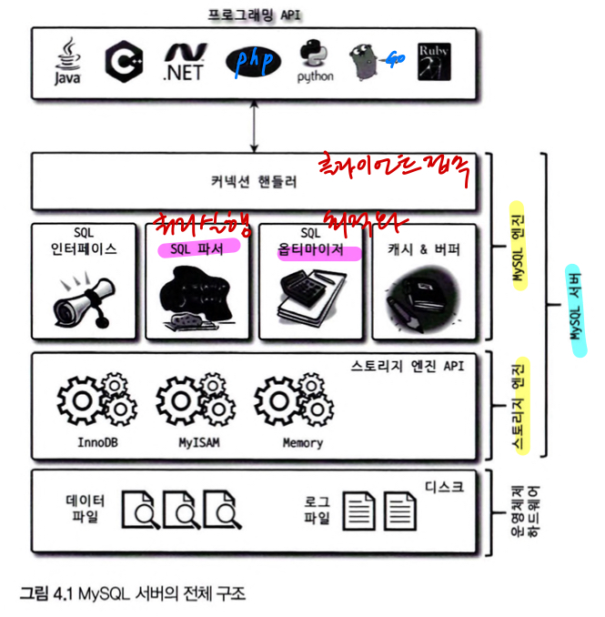
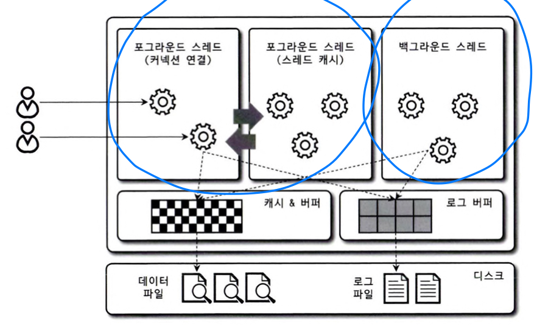
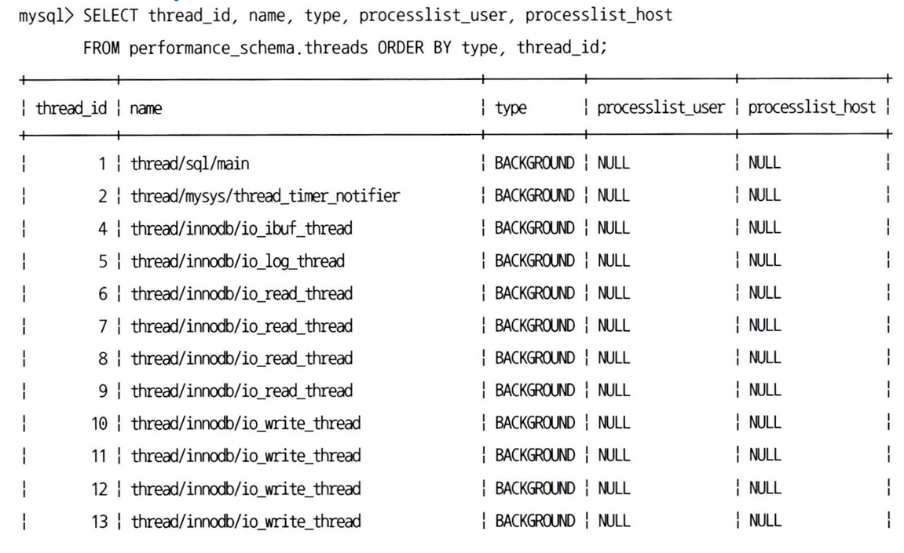
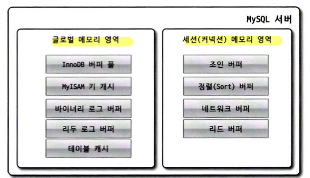

# 04. 아키텍처

MySQL 엔진 - 머리

스토리지 엔진 - 손발 : 핸들러 API를 만족하면 누구나 구현하여 MySQL서버에 추가해서 사용가능

기본 제공되는 스토리지 엔진

- InnoDB 스토리지 엔진
- MyISAM 스토리지 엔진

## 4.1 MySQL 엔진 아키텍처

### 1) MySQL 전체 구조

- 고유의 C API 부터, JDBC 같은 표준 드라이버를 제공
- 크게 `MySQL엔진`과 `스토리엔진` 으로 구분됨

### ① MySQL 엔진 - 요청된 SQL분석 및 최적화

**커넥션 핸들러 + SQL파서 및 전처리기** : 클라이언트 접속 및 쿼리 요청

**옵티마이저** : 쿼리 최적화

### ② 스토리지 엔진 - 실제 데이터를 디스크 스토리지에 저장 및 읽어옴

- MySQL서버에 MySQL엔진은 하나, 스토리지 엔진은 여러개
- 테이블이 사용할 스토리지 엔진 지정 가능

  `CREATE TABLE test_table (fd1 INT, fd2 INT) **ENGINE=INNODB**;`

성능향상을 위한 구성요소

- 키 캐시(MyISAM 스토리지 엔진)
- InnoDB 버퍼 풀(InnoDB 스토리지 엔진)

### ③ 핸들러 API

**MySQL 엔진** `== Handler Request ==>` **스토리지 엔진**

- Handler Request : 데이터를 쓰거나 읽어야 할 때, 각 스토리지 엔진에 쓰기/읽기 요청
- Handler API : Handler Request 에 사용되는 API
    - 얼마나 많은 데이터(레코드) 작업이 있었는지 확인 가능

 SHOW GLOBAL STATUS LIKE ‘Handler%’; 

      

### 2) MySQL 스레딩 구조

> MySQL은 프로세스가 아닌 스레드 기반으로 작동
>
- 포그라운드(Foreground) 스레드 - 실제 사용자 요청
- 백그라운드(Background) 스레드
    - MySQL서버 설정에 따라 가변적 개수를 가짐

 performance_schema 데이터베이스의 threads 테이블 : MySQL서버에서 실행중이 스레드 목록 

  

  …

  

  56개의 스레드중 thread/sql/one_connection 만이 실제 사용자의 요청을 처리하는 스레드다.

  동일한 이름의 스레드가 2개이상 → 병렬처리

### 스레드 모델(전통적) VS 스레드 풀 모델

포그라운드 스레드 : 스레드 커넥션

1:1 - 스레드 모델 (위의 예시)

1:N - 스레드 풀 모델 (하나의 스레드가 여러 커넥션 요청을 전담?)   *이후에 나오는 내용임

### ① 포그라운드 스레드(=클라이언트 스레드=사용자 스레드)

- 최소 MySQL 서버에 접속된 **클라이언트 수** 만큼 존재
- 클라이언트 요청 쿼리 문장 처리
- 클라이언트 작업 종료 후 → 커넥션 종료
    - 일정 개수 이하의 대기 스레드, Thread cache로 돌아감
    - 일정 개수 이상의 대기 스레드, 스레드를 종료 시킴 (Thread cache에는 일정개수의 스레드만 존재)

  `캐시에 유지할 수 있는 최대 스레드수` : thread_cache_size 시스템 변수로 설정

**데이터 처리**

- 데이터를 MySQL의 **데이터 버퍼**나 **캐시**로 부터 가져옴
- 없는경우, 직접 **디스크 데이터** or **인덱스 파일**로 부터 가져옴

> **MyISAM 테이블** - 디스크 쓰기 작업까지 **포그라운드**가 처리 (MyISAM 지연쓰기 존재. 일반적이지X)   
**InnoDB 테이블** - 데이터 버퍼나 캐시까지만 **포그라운드**가 처리 (나머지는, **백그라운드** 스레드)

### ② 백그라운드 스레드

- Insert Buffer를 병합하는 스레드
- **로그를 디스크로 기록하는 스레드(Log thread)**
- InnoDB 버퍼 풀의 데이터를 **디스크에 기록하는 스레드(Write thread)**
- 데이터를 버퍼로 읽어 오는 스레드
- 잠금이나 데드락 모니터링을하는 스레드

**읽기/쓰기 스레드 개수 설정**

MySQL5.5 부터, 데이터 읽기/쓰기 스레드를 각각 2개이상 지정 가능

- innodb_write_io_threads / innodb_read_io_threads 시스템 변수로 설정
- **읽기**의 경우 InnoDB도 포그라운드에 주로 처리
- **쓰기**는 대부분 백그라운드이다.
    - 일반적인 내장 디스크 : 2~4
    - DAS or SAN 스토리지 : 디스크를 최적으로 사용하도록 충분히 설정

**지연처리**(Buffering)

쓰기 - 지연후 **일괄 처리** 가능

읽기 - 절대 지연 불가능

> **MyISAM 테이블** - 포그라운드에서 쓰기 작업을 처리함. 일반적인 경우 쓰기지연 불가능   
**InnoDB 테이블** - **쓰기지연이 존재**함에 따라, INSERT/UPDATE/DELETE 쿼리에 따른 데이터 변경이 디스크에 완전히 저장될때 까지 기다리지 않아도 됨.

### 3) 메모리 할당 및 사용구조

**글로벌 메모리 영역** - MySQL 서버 시작시, OS로 부터 할당됨

- OS마다 할당 상이함. 간단하게 MySQL의 **시스템 변수로 설정**된 만큼이라고 생각

**로컬 메모리 영역**

→ 스레드가 공유 하는지 여부에 따라 두가지로 나뉨

### ① 글로벌 메모리 영역

클라이언트 스레드 수와 무관하게, 하나의 메모리 공간 할당

(필요에 따라 더 존재 할 수 있으나, 이는 클라이언트 스레드수와 무관함)

- 모든 스레드에 의해 공유됨

글로벌 메모리 영역 종류

- 테이블 캐시
- InnoDB 버퍼 풀
- InnoDB 어댑티브 해시 인덱스
- InnoDB 리두 로그 버퍼

### ② 세션(커넥션) 메모리 영역 (=로컬 메모리 영역=클라이언트 메모리 영역)

클라이언트 스레드가 쿼리를 처리하는데 사용하는 메모리 (클라이언트 요청 → 스레드 + 메모리 생성)

- 각 클라이언트 스레드별 독립적 할당
- 공유하지 않음

**메모리 할당**

글로벌 메모리 영역과는 달리, 크기 설정에 주의할 점은 없지만.

최악의 케이스인 메모리 부족 현상을 대비해 적절하게 할당

- 쿼리별 필요 공간만 할당. (필요없으면 할당 안함 ex. 소트버퍼 or 조인버퍼)
- **커넥션이 연결**되있는 동안 계속 할당 `ex. 커넥션 버퍼 or 결과 버퍼`
- **쿼리 실행 순간**에만 할당후 해제 `ex. 소트버퍼 or 조인버퍼`

로컬 메모리 영역 종류

- 정렬버퍼(Sort buffer)
- 조인 버퍼
- 바이너리 로그 캐시
- 네트워크 버퍼

### 4) 플러그인 스토리지 엔진 모델

여러 요구사항에 적합한 스토리지 엔진 구현을 위한 플러그인을 제공

쿼리의 실행과정 중 대부분은 **MySQL엔진** 에서 처리 (group by, order by)

**데이터 읽기/쓰기** 만 **스토리지 엔진**에서 처리 → 해당 영역의 기능만 플러그인으로 구현가능

🤚 **Handler**

MySQL엔진(사람) → 스토리지 엔진(자동차) : 스토리지 엔진을 조정하기 위한 객체

- MySQL엔진이 스토리지 엔진으로 부터 **데이터를 읽기/쓰기** 위해서는 반드시 핸들러를 통해야함
- 시스템 변수의 handle_XXX 는 명령 횟수를 의미하는 변수

### **MySQL엔진 VS 스토리지 엔진 : 어디서 하는 작업인가 판별하기!**

**MySQL서버(mysqld) 에서 지원하는 스토리지 엔진**

- Support
    - YES : mysqld에 포함O. 사용가능으로 활성화 상태
    - DEFAULT : YES와 동일 + 필수 스토리지엔진(=이 스토리지엔진이 없으면 서버 시작이 안됬을 수 있음)
    - NO : mysqld에 포함X
        - 사용을 원하면, 서버를 다시 빌드(컴파일) 해야함
        - 플러그인 형태로 빌드된 스토리지 엔진 라이브러리를 끼워 넣는 방법도 있음
    - DISABLED : mysqld에 포함 O. 파람에 의해 비활성화 상태

- 플러그인 리스트

  

> **스토리지 엔진 외에도 MySQL은 플러그인을 제공함**
- 전문 검색 엔진을 위한 검색어 파서
- 사용자 인증을 위한 플러그인
- 쿼리 재작성
>

### 5) 컴포넌트

MySQL 8.0부터 **플러그인 아키텍처**를 대처하는 **컴포넌트 아키텍처** 지원

**플러그인의 단점**

- 오직 MySQL서버 와 인터페이스 가능. 플러그인끼리는 불가능
- MySQL서버의 변수나 함수를 직접 호출(캡슐화X) → 안전하지 않음
- 상호 의존 관계 설정X → 초기화 어려움

- 비밀번호 검증 (5.7 플러그인 → 8.0 컴포넌트)

  

### 6) 쿼리 실행 구조

### ① 쿼리 파서

사용자 요청 쿼리 문장을 **토큰**(MySQL이 인식할 수 있는 최소 단위의 어휘/기호)으로 분리

**트리 형태 구조**로 만듦

- 쿼리 문장의 기본 문법 오류 발견 → 사용자에게 오류 메세지 전달

### ② 전처리기

파서 트리 기반으로 쿼리 문장의 **구조적 문제점** 확인

각 토큰을 테이블 이름, 칼럼 이름, 내장 함수 같은 개체와 매핑 → **존재여부 or 접근권한 확인**

### ③ 옵티마이저

저렴한 비용으로 빠르게 처리할지 결정 (DBMS의 두뇌)

### ④ 실행 엔진

(DBMS 손과 발 feat. 핸들러)

ex. 옵티마이저가 GROUP BY 처리를 위해 임시 테이블 사용 결정

### ⑤ 핸들러(스토리지 엔진)

가장 밑단에서 실행엔진의 요청에 따라 **디스크에서 데이터를 읽고,쓴다**

### 7) 복제

16장에서 자세히

### 8) 쿼리 캐시

빠른 응답이 요구되는 웹 기반 응용 프로그램에서 매우 중요

- SQL실행 결과를 메모리에 캐시 → 동일 쿼리 실행시 테이블을 읽지 않고 결과 반환
- 테이블 데이터 변경시, 해당 테이블 관련 캐시는 모두 삭제(Invalidate)
- 동시 처리 성능 저하 및 버그의 원인 (사실상 변경없이 읽기만 해야 좋은 기능임)

**MySQL 8.0에서 해당 기능 완전 제거** (관련 시스템 변수 모두)

### 9) 스레드 풀

엔터프라이즈 에디션에서만 제공(MySQL서버 프로그램에 내장)

- 커뮤니티 에디션에서 사용가능한 Percona Server에서 제공하는 스레드풀
    - 플러그인 형태
    - 동일버전 Percona Server에서 thread pool plugin library(thread_pool.so) 를 설치해서 사용
    - CPU 코어 개수 만큼 스레드 그룹 생성 (프로세서 친화도를 높이기에 좋음)
    - `thread_pool_size` 스레드 그룹개수
    - `thread_pool_oversubscribe` 이미 스레드 풀이 차있는경우 해당 개수 만큼 요청을 추가로 받으면, 새로운 풀을 만든다 (default: 3)

**스레드풀의 목적**

- 많은 사용자의 요청이 있더라도, 동시처리 양을 제어해 CPU가 집중할 수 있게함
- 서버의 자원 소모를 줄임

→ 적절한 수를 제한한다면, CPU의 Processor affinity(프로세서 친화도)를 높히고 + 불필요한 Context swich를 줄여 오버헤드를 낮출 수 있다.

**스레드 그룹의 모든 스레드가 일을하고 있다** → 다음 스레드 만들기? 기다리기?

`thread_pool_stall_limit` : 주기적으로 설정된 밀리초만큼 작업 스레드가 처리중이 작업을 끝내지 못하면, 새로운 스레드를 만들어서 스레드 그룹에 추가 (이때, 추가되는 스레드의 수는 thread_pool_max_threads를 넘을수 없음)

- 이는 최소  `thread_pool_stall_limit` 시간을 기다려야 새로운 요청 처리가능 하다는의미
- 그렇다고 이걸 0으로 하는건 권장하지 않음 (이럴꺼면 스레드풀 쓰지 않는게 나음)
- 응답 속도를 위해 0에 가까운 적절한 값을 찾아야함

### 10) 트랜잭션 지원 메타데이터

데이터 딕셔너리(=메타데이터) : 테이블 구조 정보 + 스토어드 프로그램의 정보

MySQL 5.7 - 테이블 구조를 FRM파일에 저장 + 일부 스토어드 프로그램도 파일 기반 관리(TRN, TRG, PAR)

- 파일 기반의 메타데이터는 생성/변경 작업에 대한 트랜잭션을 지원X
- 비정상적 종료에 따른 일관성 문제 발생 (ex. DB or TABLE이 깨짐)

MySQL 8.0 - 테이블 구조 + 스토어드 프로그램 코드 관련 정보 → InnoDB의 테이블에 저장

- 시스템 테이블 : MySQL 서버가 작동하는데 필요한 테이블 (ex. 인증, 권한 관련 테이블)
- mysql.idb 테이블스페이스

**information_schema VIEW**

- 테이블에 저장한다고 했지만, 사용자의 임의 조작을 막기 위해 테이블을 볼 수 없게함
- 뷰를 통해 데이터를 볼 수 있다.

  `SHOW CREATE TABLE INFORMATION_SCHEMA.TABLES;`

- 테이블에 직접 접근시 접근거절 에러가 발생 (tables, columns)

  

테이블에 저장하는건 InnoDB 이고, MyISAM or CSV는 어쩌나?

- SDI(Serialized Dictionary Information) 파일 (*.sdi)
- InnoDB의 테이블들의 구조도 SDI파일로 변환 가능
    - ibd2sdi 유틸리티 이용
